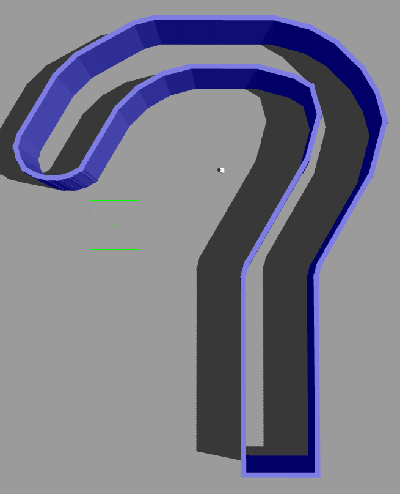

<h1> FEUP-RI-PROJ </h1>

- [Project Description](#project-description)
- [Folder Structure \& ROS Packages](#folder-structure--ros-packages)
  - [my\_reactive\_robot](#my_reactive_robot)
  - [my\_controller](#my_controller)
- [The Environment](#the-environment)
- [Dependencies](#dependencies)
- [How to Run](#how-to-run)

## Project Description

This project consists in the development of a reactive robot that is able to navigate autonomously in a simulated environment. The robot is able to avoid obstacles and reach a goal position. The robot is simulated in Gazebo and the simulation is controlled using ROS.

The environment is a question marked shaped world, and the robot used is a differential drive robot with a LIDAR sensor, the Turtlebot3 Burger.

## Folder Structure & ROS Packages

```bash
├── README.md                   # This file.
├── report/                     # Report files
├── src
│   ├── build/                  # Build files
|   ├── install/                # Install files
│   ├── log/                    # Log files
│   ├── my_reactive_robot/      # ROS package to spawn robot and run gazebo
|   |   ├── launch/
|   |   |  ├── launch.py        # Launch file to run world
|   |   ├── worlds/
|   |   |  ├── my_world.world/  # World file
|   |   | ...
│   ├── my_controler/           # ROS package to control robot
|   |   ├── my_controller/
|   |   |  ├── controller.py    # Controller file
|   |   |  ├── ...
|   |   | ...
| ...
```

Two ROS packages were created, `my_reactive_robot` and `my_controller`.

### my_reactive_robot

This package is responsible for spawning the robot in the world and running the simulation. The [launch file](src/my_reactive_robot/launch/launch.py) is an adaptation from the file `turtlebot3_world.launch` from the package `turtlebot3_gazebo`.

Four commands are launched:

- `gzserver_cmd`  - Gazebo server for simulating physics, sensors, rendering, etc.
- `gzclient_cmd`  - Gazebo client for displaying the GUI and visualization
- `robot_state_publisher_cmd` - Publishes the state of the robot
- `spawn_turtlebot3_cmd` - Spawns the robot in the world

The world file is a custom world, [my_world.world](src/my_reactive_robot/worlds/my_world.world), that was created using the Gazebo GUI.

### my_controller

This package is responsible for controlling the robot. The [controller file](src/my_controller/my_controller/controller.py) is a Python script that subscribes to the topic `/scan` and publishes to the topic `/cmd_vel`. The controller uses the LIDAR sensor to detect the w

Two nodes were created:

- `spin_randomly_node` - Spins the robot randomly for 5 seconds.
- `scan_to_velocity_node` - Subscribes to the topic `/scan` and publishes the desired velocity to the topic `/cmd_vel`.

When the robot first spawns, only `x` and `y` coordinates are random, but the orientation is hard-coded. To solve this we created the `spin_randomly_node` node: it spins the robot randomly for 5 seconds, and then `scan_to_velocity_node` takes over.

## The Environment

Question mark shaped, strait line below, imperfect circle above, circle ends in round shape, bottom is strait and edgy shape.

<p align="center">
  
</p>

The robot spawns with a random position and orientation inside the roundish part, at the top of the world.

## Dependencies

- A working installation of a ROS distribution.

> This project was developed using ROS2 Humble, so we can't guarantee that it will work in ROS1 distributions.

Please install the following dependencies before running the project:

**turtlebot3_gazebo**

`sudo apt install ros-$ROS_DISTRO-turtlebot3*`

**gazebo_ros**

`sudo apt install ros-$ROS_DISTRO-gazebo-ros-pkgs`.

If using ROS1, please run `sudo apt install ros-$ROS_DISTRO-gazebo-ros-control` as well.

## How to Run

0. Source your ROS distribution.

    Run `source /opt/ros/$ROS_DISTRO/setup.bash` or add this line to your `.bashrc` file to source it automatic on every new terminal instance.

1. Clone this repository.
2. Change into the root directory of the repository.
3. Run `colcon build` to build the packages. Add the flag `sym-link-install` to create a symbolic link to the packages instead of copying them.
4. Run `source install/setup.bash` to source the packages.

    To avoid running this command on every new terminal instance, add this line to your `.bashrc` file. Modify the path accordingly.

5. Set up the Turtlebot3 model.

    Run `export TURTLEBOT3_MODEL=burger` to set the model to Burger. Other possible models are `waffle` and `waffle_pi`. Add this line to your `.bashrc` file to avoid running it on every new terminal instance.

6. Set up Gazebo model path

    ```export GAZEBO_MODEL_PATH=$GAZEBO_MODEL_PATH:`ros2 pkg \ prefix turtlebot3_gazebo \
    `/share/turtlebot3_gazebo/models/```

7. Open two terminals.
   1. In the first terminal, run `ros2 launch my_reactive_robot launch.py` to launch the world. Wait for the world to load.
   2. In the second terminal, run `ros2 run my_controller controller.py` to launch the controller.

> Please note that we have setup Gazebo to start in a paused state. To start the simulation, press the play button in the Gazebo GUI.